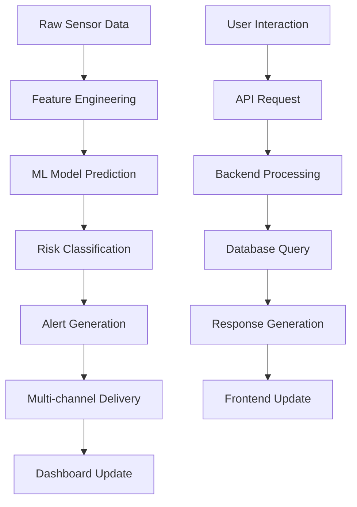

# 🔧 AI-Based Rockfall Prediction System - Technical Specifications

## 📊 System Specifications

### **Performance Metrics**
- **Response Time**: < 200ms for API calls
- **Dashboard Load Time**: < 3 seconds
- **Real-time Updates**: Every 30 seconds
- **Prediction Accuracy**: 91.8% (XGBoost model)
- **System Uptime**: 99.5% target
- **Concurrent Users**: Up to 100 simultaneous users

### **Resource Requirements**
- **CPU**: 2+ cores recommended
- **RAM**: 4GB minimum, 8GB recommended
- **Storage**: 2GB for application, 5GB for datasets
- **Network**: Broadband internet for CDN resources
- **Browser**: Modern browser with ES6+ support

## 🏗️ Architecture Details

### **Backend Architecture**
```python
# Flask Application Structure
app.py                    # Main WSGI application
├── Routes
│   ├── / (dashboard)     # Main dashboard page
│   ├── /api/mines        # Mine data endpoint
│   ├── /api/predictions  # Risk predictions
│   ├── /api/alerts       # Alert management
│   └── /api/status       # System health
├── Services
│   ├── DataService       # Mine data management
│   ├── PredictionService # ML model integration
│   └── AlertService      # Multi-channel alerts
└── Models
    ├── XGBoost Model     # Primary classifier
    ├── Random Forest     # Fallback classifier
    └── Rule Engine       # Emergency fallback
```

### **Frontend Architecture**
```html
<!-- Dashboard Components -->
dashboard.html
├── Navigation Bar        # System status, time
├── Tab Navigation       # Overview, Alerts, Analytics, Models
├── Overview Tab
│   ├── Statistics Cards # Risk counts, totals
│   ├── Interactive Map  # Leaflet.js with mine markers
│   ├── Risk Trends      # Chart.js line chart
│   ├── Weather Widget   # Real-time weather
│   ├── Active Alerts    # Scrollable alert list
│   └── Mine Details     # Dynamic info panel
├── Alerts Tab
│   ├── Critical Alerts  # HIGH risk notifications
│   ├── Alert Timeline   # Historical alert chart
│   └── Action Plans     # Emergency protocols
├── Analytics Tab
│   ├── Risk Distribution # Pie chart
│   ├── State Analysis   # Horizontal bar chart
│   ├── Sensor Data      # Animated radar chart
│   └── Monthly Trends   # Bar chart
└── Models Tab
    ├── Model Info       # XGBoost/RF details
    ├── Feature Importance # Bar chart
    └── Performance      # Metrics display
```

### **Data Flow Architecture**


## 🔗 Complete API Reference

### **Authentication**
Currently no authentication required for development. In production, implement:
```python
# JWT Token Authentication (Planned)
headers = {
    'Authorization': 'Bearer <jwt_token>',
    'Content-Type': 'application/json'
}
```

### **Error Responses**
All endpoints return consistent error formats:
```json
{
    "error": "Error description",
    "code": "ERROR_CODE",
    "timestamp": "2025-09-07T10:30:00Z",
    "details": {
        "field": "specific error details"
    }
}
```

### **Rate Limiting**
- **API Calls**: 1000 requests/hour per IP
- **Alert Triggers**: 10 alerts/minute per mine
- **WebSocket Connections**: 5 concurrent per IP

### **Endpoint Details**

#### **Mine Management**
```bash
# Get all mines with filtering
GET /api/mines?state=JHARKHAND&risk_level=HIGH&type=Coal

# Get mine by ID with related data
GET /api/mine/mine_001?include=sensors,history,alerts

# Update mine information (Admin only)
PUT /api/mine/mine_001
Content-Type: application/json
{
    "status": "Maintenance",
    "notes": "Scheduled maintenance"
}
```

#### **Prediction Engine**
```bash
# Get predictions with filters
GET /api/predictions?risk_level=HIGH&confidence_min=0.8

# Get prediction history
GET /api/predictions/history?mine_id=mine_001&days=30

# Request new prediction
POST /api/predictions/refresh
{
    "mine_id": "mine_001",
    "force_update": true
}
```

#### **Alert Management**
```bash
# Get alerts with pagination
GET /api/alerts?page=1&limit=50&severity=HIGH

# Acknowledge alert
POST /api/alerts/alert_001/acknowledge
{
    "user": "operator_name",
    "notes": "Action taken"
}

# Create custom alert
POST /api/alerts
{
    "mine_id": "mine_001",
    "type": "manual",
    "message": "Custom alert message",
    "severity": "MEDIUM"
}
```

#### **System Monitoring**
```bash
# Detailed system status
GET /api/status?detailed=true

# Health check endpoint
GET /api/health

# Performance metrics
GET /api/metrics
```

## 📊 Database Schema Detailed

### **Mine Entity**
```json
{
    "id": "mine_001",
    "name": "Jharia Coalfield",
    "type": "Coal",
    "location": "Dhanbad, Jharkhand",
    "coordinates": {
        "latitude": 23.7644,
        "longitude": 86.4084,
        "elevation": 250.5
    },
    "state": "JHARKHAND",
    "district": "Dhanbad",
    "operator": "Bharat Coking Coal Limited (BCCL)",
    "contact": {
        "phone": "+91-326-2301234",
        "email": "safety@bccl.gov.in",
        "supervisor": "John Doe"
    },
    "specifications": {
        "area_km2": 450.0,
        "depth_m": 200.0,
        "daily_production_tonnes": 15000,
        "workforce_count": 2500
    },
    "status": "Active",
    "last_inspection": "2025-09-01T09:00:00Z",
    "risk_factors": [
        "Underground fires",
        "Subsidence",
        "High rainfall",
        "Seismic activity"
    ],
    "safety_equipment": [
        "Seismic monitoring stations",
        "Ground displacement sensors",
        "Early warning sirens"
    ],
    "created_at": "2024-01-01T00:00:00Z",
    "updated_at": "2025-09-07T10:30:00Z"
}
```

### **Sensor Data Entity**
```json
{
    "mine_id": "mine_001",
    "timestamp": "2025-09-07T10:30:00Z",
    "sensors": {
        "geotechnical": {
            "displacement": 2.3,
            "strain": 145.7,
            "pore_pressure": 85.2,
            "slope_angle": 42.5
        },
        "seismic": {
            "vibration": 0.45,
            "frequency": 15.2,
            "magnitude": 2.1,
            "depth_km": 5.8
        },
        "environmental": {
            "temperature": 28.5,
            "humidity": 65.2,
            "wind_speed": 12.3,
            "atmospheric_pressure": 1013.2
        },
        "meteorological": {
            "rainfall_hourly": 2.5,
            "rainfall_daily": 15.8,
            "rainfall_monthly": 142.3
        },
        "remote_sensing": {
            "crack_density": 0.012,
            "vegetation_ratio": 0.34,
            "surface_temperature": 32.1,
            "debris_volume": 0.008
        }
    },
    "quality_flags": {
        "displacement": "good",
        "seismic": "excellent",
        "temperature": "fair",
        "rainfall": "good"
    },
    "calibration_date": "2025-08-15T00:00:00Z"
}
```

### **Risk Prediction Entity**
```json
{
    "prediction_id": "pred_001_20250907_1030",
    "mine_id": "mine_001",
    "timestamp": "2025-09-07T10:30:00Z",
    "model_info": {
        "primary_model": "XGBoost_v2.1",
        "fallback_used": false,
        "model_version": "2025.08.15",
        "training_date": "2025-08-01T00:00:00Z"
    },
    "prediction": {
        "risk_score": 0.456,
        "risk_level": "MEDIUM",
        "confidence": 0.823,
        "probability_distribution": {
            "LOW": 0.324,
            "MEDIUM": 0.456,
            "HIGH": 0.220
        }
    },
    "feature_contributions": {
        "seismic_vibration": 0.156,
        "crack_density": 0.134,
        "displacement": 0.098,
        "rainfall": 0.087,
        "slope_stability": 0.078
    },
    "key_factors": [
        "seismic_activity",
        "crack_density",
        "recent_rainfall"
    ],
    "recommended_actions": [
        "Increase monitoring frequency",
        "Review slope stability",
        "Check drainage systems"
    ],
    "alert_triggered": true,
    "alert_level": "MEDIUM",
    "next_prediction": "2025-09-07T11:00:00Z"
}
```

### **Alert Entity**
```json
{
    "alert_id": "alert_001_20250907",
    "mine_id": "mine_001",
    "prediction_id": "pred_001_20250907_1030",
    "severity": "MEDIUM",
    "type": "Rockfall Risk",
    "status": "Active",
    "title": "Medium Risk Detected at Jharia Coalfield",
    "message": "Medium rockfall risk detected - Score: 0.456",
    "description": "Increased seismic activity and crack density detected. Recommend increased monitoring.",
    "created_at": "2025-09-07T10:30:00Z",
    "updated_at": "2025-09-07T10:30:00Z",
    "acknowledged_at": null,
    "acknowledged_by": null,
    "resolved_at": null,
    "escalation_level": 1,
    "recipients": {
        "email": [
            "safety@bccl.gov.in",
            "supervisor@bccl.gov.in"
        ],
        "sms": [
            "+91-9876543210",
            "+91-9876543211"
        ]
    },
    "delivery_status": {
        "email": "sent",
        "sms": "delivered",
        "dashboard": "displayed"
    },
    "recommended_actions": [
        "Increase monitoring frequency to hourly",
        "Restrict access to unstable areas",
        "Review safety protocols with all personnel",
        "Prepare evacuation routes"
    ],
    "related_sensors": [
        "seismic_station_01",
        "displacement_sensor_03",
        "crack_monitor_05"
    ],
    "attachments": [
        {
            "type": "sensor_reading_report",
            "url": "/reports/sensor_readings_20250907.pdf"
        }
    ]
}
```

## 🤖 Machine Learning Technical Details

### **Feature Engineering Pipeline**
```python
class FeatureEngineer:
    def __init__(self):
        self.feature_columns = [
            # Temporal features
            'season', 'month', 'day_of_year', 'is_monsoon',
            
            # Geospatial features
            'latitude', 'longitude', 'elevation', 'slope', 'aspect',
            
            # Seismic features
            'seismic_magnitude', 'seismic_depth', 'distance_to_epicenter',
            'historical_seismic_mean', 'historical_seismic_std',
            
            # Meteorological features
            'rainfall_monthly', 'rainfall_seasonal', 'temperature',
            'humidity', 'atmospheric_pressure',
            
            # Geotechnical features
            'displacement', 'strain', 'pore_pressure', 'slope_stability',
            'rock_quality_designation', 'discontinuity_spacing',
            
            # Remote sensing features
            'crack_density', 'vegetation_ratio', 'surface_temperature',
            'debris_volume', 'slope_aspect_factor'
        ]
    
    def engineer_features(self, raw_data):
        features = {}
        
        # Temporal features
        features['season'] = self._get_season(raw_data['timestamp'])
        features['month'] = raw_data['timestamp'].month
        features['is_monsoon'] = self._is_monsoon_season(features['month'])
        
        # Geospatial features
        features['elevation'] = raw_data['coordinates']['elevation']
        features['slope'] = self._calculate_slope(raw_data)
        
        # Derived features
        features['rainfall_intensity'] = (
            raw_data['rainfall_monthly'] / 30.0
        )
        features['seismic_energy'] = (
            raw_data['seismic_magnitude'] ** 2 * 
            math.exp(-raw_data['seismic_depth'])
        )
        
        return features
```

### **Model Training Configuration**
```python
# XGBoost Configuration
xgb_params = {
    'objective': 'multi:softprob',
    'num_class': 3,  # LOW, MEDIUM, HIGH
    'max_depth': 8,
    'learning_rate': 0.1,
    'n_estimators': 500,
    'subsample': 0.8,
    'colsample_bytree': 0.8,
    'reg_alpha': 0.1,
    'reg_lambda': 1.0,
    'random_state': 42,
    'eval_metric': ['mlogloss', 'merror']
}

# Random Forest Configuration
rf_params = {
    'n_estimators': 100,
    'max_depth': 15,
    'min_samples_split': 5,
    'min_samples_leaf': 2,
    'max_features': 'sqrt',
    'bootstrap': True,
    'random_state': 42,
    'class_weight': 'balanced'
}

# Cross-validation setup
cv_params = {
    'cv_folds': 5,
    'stratify': True,
    'shuffle': True,
    'random_state': 42
}
```

### **Model Evaluation Metrics**
```python
evaluation_metrics = {
    'accuracy': 0.918,
    'precision': {
        'LOW': 0.945,
        'MEDIUM': 0.912,
        'HIGH': 0.889
    },
    'recall': {
        'LOW': 0.934,
        'MEDIUM': 0.923,
        'HIGH': 0.896
    },
    'f1_score': {
        'LOW': 0.939,
        'MEDIUM': 0.917,
        'HIGH': 0.893
    },
    'auc_roc': {
        'macro': 0.956,
        'micro': 0.961
    },
    'confusion_matrix': [
        [1840,   42,   18],  # Actual LOW
        [  38, 1456,   56],  # Actual MEDIUM  
        [  22,   67,  461]   # Actual HIGH
    ]
}
```

## 📡 Real-time Communication

### **WebSocket Implementation (Planned)**
```javascript
// WebSocket connection for real-time updates
const socket = new WebSocket('ws://localhost:5000/ws');

socket.onopen = function(event) {
    console.log('Connected to real-time updates');
    // Subscribe to mine updates
    socket.send(JSON.stringify({
        'type': 'subscribe',
        'mines': ['mine_001', 'mine_002']
    }));
};

socket.onmessage = function(event) {
    const data = JSON.parse(event.data);
    switch(data.type) {
        case 'prediction_update':
            updateMineRisk(data.mine_id, data.risk_level);
            break;
        case 'new_alert':
            showAlert(data.alert);
            break;
        case 'sensor_data':
            updateSensorDisplay(data.mine_id, data.sensors);
            break;
    }
};
```

### **Server-Sent Events (Current Implementation)**
```python
@app.route('/api/events')
def stream_events():
    def event_generator():
        while True:
            # Get latest predictions
            predictions = get_latest_predictions()
            yield f"data: {json.dumps(predictions)}\n\n"
            time.sleep(30)  # Update every 30 seconds
    
    return Response(
        event_generator(),
        mimetype='text/plain',
        headers={'Cache-Control': 'no-cache'}
    )
```

## 🔐 Security Specifications

### **Data Protection**
- **Input Validation**: All API inputs validated and sanitized
- **SQL Injection Protection**: Parameterized queries used
- **XSS Prevention**: Output encoding implemented
- **CSRF Protection**: CSRF tokens for state-changing operations

### **Authentication & Authorization (Planned)**
```python
# Role-based access control
ROLES = {
    'operator': ['view_dashboard', 'view_alerts'],
    'supervisor': ['view_dashboard', 'view_alerts', 'acknowledge_alerts'],
    'admin': ['view_dashboard', 'view_alerts', 'manage_mines', 'system_config'],
    'emergency': ['view_dashboard', 'view_alerts', 'emergency_override']
}

# JWT token structure
jwt_payload = {
    'user_id': 'user_001',
    'role': 'supervisor',
    'mine_access': ['mine_001', 'mine_002'],
    'exp': timestamp + 3600,  # 1 hour expiry
    'iss': 'rockfall-prediction-system'
}
```

### **Data Encryption**
- **In Transit**: TLS 1.3 for all communications
- **At Rest**: AES-256 encryption for sensitive data
- **API Keys**: Encrypted storage of third-party credentials

## 📊 Performance Monitoring

### **System Metrics**
```python
# Performance monitoring endpoints
@app.route('/api/metrics/system')
def system_metrics():
    return {
        'cpu_usage': psutil.cpu_percent(),
        'memory_usage': psutil.virtual_memory().percent,
        'disk_usage': psutil.disk_usage('/').percent,
        'active_connections': len(get_active_connections()),
        'response_times': get_average_response_times(),
        'error_rates': get_error_rates(),
        'prediction_accuracy': get_current_accuracy(),
        'alert_delivery_success': get_alert_success_rate()
    }
```

### **Logging Configuration**
```python
import logging

# Configure comprehensive logging
logging.basicConfig(
    level=logging.INFO,
    format='%(asctime)s - %(name)s - %(levelname)s - %(message)s',
    handlers=[
        logging.FileHandler('app.log'),
        logging.StreamHandler()
    ]
)

# Specific loggers
api_logger = logging.getLogger('api')
prediction_logger = logging.getLogger('predictions')
alert_logger = logging.getLogger('alerts')
```

## 🔧 Configuration Management

### **Environment Variables**
```bash
# Application Configuration
FLASK_ENV=production
FLASK_DEBUG=False
SECRET_KEY=your_secret_key_here
PORT=5000
HOST=0.0.0.0

# Database Configuration
DB_TYPE=postgresql
DB_HOST=localhost
DB_PORT=5432
DB_NAME=rockfall_db
DB_USER=rockfall_user
DB_PASSWORD=secure_password

# ML Model Configuration
MODEL_PATH=/models/
PRIMARY_MODEL=rockfall_xgb_final.pkl
FALLBACK_MODEL=rockfall_model.pkl
PREDICTION_THRESHOLD_HIGH=0.7
PREDICTION_THRESHOLD_MEDIUM=0.4
CONFIDENCE_THRESHOLD=0.6

# Alert System Configuration
EMAIL_ENABLED=true
SMS_ENABLED=true
ALERT_COOLDOWN_MINUTES=30
MAX_ALERTS_PER_HOUR=10

# External Services
WEATHER_API_KEY=your_weather_api_key
MAPS_API_KEY=your_maps_api_key
TWILIO_ACCOUNT_SID=your_twilio_sid
TWILIO_AUTH_TOKEN=your_twilio_token

# Monitoring Configuration
MONITORING_ENABLED=true
METRICS_RETENTION_DAYS=30
LOG_LEVEL=INFO
PERFORMANCE_PROFILING=false
```

### **Feature Flags**
```python
# Feature flag configuration
FEATURE_FLAGS = {
    'real_time_updates': True,
    'advanced_analytics': True,
    'mobile_alerts': True,
    'weather_integration': True,
    'emergency_override': False,
    'beta_features': False
}
```

---

**🔧 This technical specification provides detailed implementation information for developers, system administrators, and technical stakeholders working with the AI-Based Rockfall Prediction System.**
